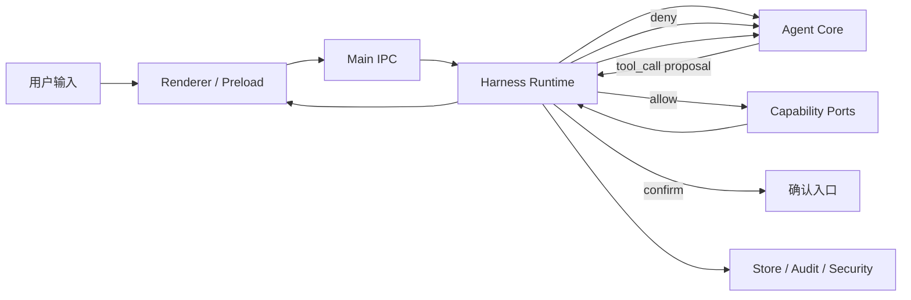

# 后端架构蓝图

> 更新时间：2026-04-07 17:09:21
> 目的：把“当前已经实现的后端结构”和“接下来要定的后端结构”一次讲清，避免继续边写边漂。

## 1. 一句话

当前项目的后端主线应该固定为：

`Adapter -> Harness Runtime -> Agent Core -> Capability Ports -> Data/Security`

其中：

- `Adapter` 负责收发消息和事件桥接
- `Harness Runtime` 负责 run、状态机、准入、确认、审计
- `Agent Core` 负责思考、上下文、ReAct Loop
- `Capability Ports` 负责真正执行工具和 MCP
- `Data/Security` 负责存储、规则、日志、系统资源访问

## 2. 当前状态总览

### 2.1 已定

- 后端分层按 `Adapter / Harness / Agent / Ports / Data` 走
- `run` 是执行一等公民，不再把一次执行只看成“发了一条消息”
- 模型只能提议 `tool_call`，不能直接落副作用
- 内置工具和 MCP 工具都要先过 Harness
- Renderer 只做事件投影，不做副作用准入

### 2.2 暂定

- 当前确认入口先用 Electron 原生弹窗，后面再替换成 Renderer 内嵌确认 UI
- 当前活动 run 持久化到 `userData/data/harness-runs.json`
- 应用重启后先做“残留 run 对账”，暂不做真正自动续跑
- context 必须是用户可控能力，后续支持手动 `compact`

### 2.3 待定

- approval 单独怎么存
- `awaiting_confirmation` 如何恢复到 UI
- `transformContext` 最终接口长什么样
- 手动 `compact` 的触发协议、落盘范围和回放语义
- `memory_search / RAG / embedding` 怎么接进 Agent Core
- run 级别数据是继续只放 session，还是单独拆 `runs/`

## 3. 当前实际分层

| 层 | 作用 | 当前代码 | 状态 |
|---|---|---|---|
| Adapter | IPC、事件桥接、确认入口 | `src/preload/` `src/main/adapter.ts` `src/shared/ipc.ts` `src/shared/agent-events.ts` | 已有 |
| Harness Runtime | run 生命周期、policy、tool gate、audit、活动 run 持久化 | `src/main/harness/` | 已起骨架 |
| Agent Core | pi-agent-core 封装、system prompt、消息适配、模型装配 | `src/main/agent.ts` `src/main/chat-message-adapter.ts` `src/main/soul.ts` | 部分完成 |
| Capability Ports | 内置工具、MCP 工具、系统能力调用 | `src/main/tools/` `src/mcp/` `src/tools/getTime.ts` | 已有 |
| Data / Security | session/settings/providers/git/files/terminal/security | `src/main/store.ts` `src/main/settings.ts` `src/main/providers.ts` `src/main/security.ts` 等 | 已有 |

## 4. 核心对象

这 5 个对象后面不能再混写：

### 4.1 Session

用户看到的聊天线程。

负责：

- 消息历史
- 附件
- 标题
- UI 回放所需步骤

不负责：

- 当前 run 是否活跃
- 当前确认是否待处理

### 4.2 Run

一次用户输入触发的一次执行。

负责：

- 执行状态
- 当前 step
- pending approval
- 审计关联

### 4.3 Step

run 内的执行单元。

负责：

- thinking
- tool_call
- tool_result
- final_text

### 4.4 Approval

待确认动作。

负责：

- 绑定 `runId`
- 绑定具体 payload
- 允许恢复
- 支持拒绝 / 允许 / 超时

### 4.5 AuditEvent

结构化留痕。

负责：

- 决策可追踪
- 故障可定位
- run 与 session 关联

## 5. 后端正确数据流

关键点：

- `tool_call` 回到 Harness，而不是直接去工具层
- `Store` 不是入口，只是运行结果和运行痕迹的落点
- `Security` 不应该散在 UI 或 Agent Core

## 6. 当前文件怎么理解

### 6.1 可以继续长的地方

- `src/main/harness/`
- `src/main/tools/`
- `src/mcp/`
- `src/main/store.ts` 周边数据服务
- `src/shared/`
- `src/renderer/`

### 6.2 现在不要再扩业务的地方

- `src/agent/`
- `src/chatgpt/`
- `src/main.ts`

这三个现在算遗留入口，不是主链路。

## 7. 现在还没处理完的问题

### 7.1 approval 还没成为真正的一等对象

现在已经有确认行为，但还没有完整的 approval 存储和恢复模型。

影响：

- 应用重启后不能回到“继续确认”
- `confirmResponse` 链路还是半成品

### 7.2 Agent Core 还没有真正的上下文治理

现在只有基本 system prompt 和历史消息恢复，没有真正的：

- `transformContext`
- 用户可控的 context 策略
- 手动 `compact`
- 长历史压缩
- 记忆注入
- token 预算治理

### 7.3 记忆系统还没接上主链路

spec 里有 T0 / T1 / T2，但当前只有 Soul 文件这一层在工作。

缺的：

- `memory_search`
- RAG 检索
- embedding 写入
- MEMORY 原始文件结构

### 7.4 run 和 session 的边界还没完全收口

现在 run 已经独立出来，但 session 持久化里还没有完整 run 轨迹模型。

缺的：

- session 与 run 的稳定关联字段
- approval 在 session 内如何回放
- run 失败后 UI 怎么恢复到可理解状态

### 7.5 Renderer 还不是完整的 Harness 前端

现在它主要是事件显示层，还不是完整的 Harness 交互层。

缺的：

- 内嵌确认 UI
- run 恢复提示
- 审计/失败恢复入口

### 7.6 审计已经有入口，但还没有形成产品能力

现在 `audit.log` 已经开始写，但还缺：

- 统一 event schema 收口
- 查询/过滤能力
- UI 展示或调试入口

## 8. 推荐的收敛顺序

不要乱跳，建议按这个顺序：

1. 先封后端接口
   - 把 `Run / Approval / AuditEvent` 类型继续定稳
2. 再做 approval 完整链路
   - 存储
   - 响应
   - 恢复
3. 再补 session/run 关联
   - 让回放和恢复语义稳定
4. 再做 Agent Core 上下文治理
   - `transformContext`
   - 手动 `compact`
   - memory_search
5. 最后补 UI 体验层
   - Renderer 内确认
   - run 恢复提示
   - 审计可视化

## 9. React 视角类比

为了让你更好理解，可以这样看：

| 后端对象 | React 类比 |
|---|---|
| Session | 页面级业务数据 |
| Run | 一次异步 action 的执行实例 |
| Harness Runtime | 严格版 reducer + middleware + permission gate |
| Agent Core | 产生 action proposal 的智能层 |
| Tool / MCP | 真正的 side effects |
| Audit Log | devtools + action log |

所以后端现在最重要的事，不是“多加几个能力”，而是把：

`状态`
`副作用`
`权限`
`留痕`

这四件事拆干净。

补一条针对 context 的原则：

- UI 可以展示 context 使用量、提供 `compact` 按钮
- 但真正的 compact 逻辑必须落在 Agent Core / context 管理链路
- Harness 只负责把这次 compact 视为一个可追踪 run 内动作，不负责决定压缩算法本身

## 10. 当前结论

现在可以明确下来的判断是：

- 当前项目已经有后端主线了，不是从零开始
- 但还处在“骨架已出现，边界未完全封死”的阶段
- 这时候最该做的不是猛加功能，而是继续收紧后端对象和链路

一句话：

`先把后端收成一个能解释清、能追踪、能恢复的系统，再继续往上长功能。`
